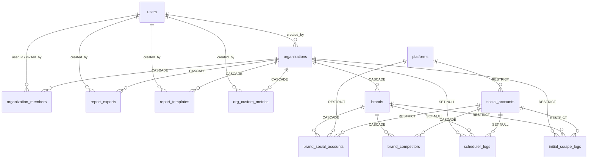

# Kepiai — Dokumentasi Schema `public`

Referensi lengkap schema **`public`** pada database Kepiai (PostgreSQL + TimescaleDB), hasil introspeksi langsung dari database live. Schema ini adalah **layer aplikasi** — tenancy, identitas, konfigurasi, dan artefak yang dibuat pengguna. Data sosial media mentah sampai agregat tinggal di schema lain (`l0_raw` → `l0_harmonization` → `l1_silver` → `feature` → `l2_gold`).

- [1. Posisi `public` dalam arsitektur](#1-posisi-public-dalam-arsitektur)
- [2. Daftar tabel](#2-daftar-tabel)
- [3. Relasi antar tabel (ERD)](#3-relasi-antar-tabel-erd)
- [4. Konvensi umum](#4-konvensi-umum)
- [5. Detail per tabel](#5-detail-per-tabel)
- [6. Tipe ENUM](#6-tipe-enum)
- [7. Objek non-aplikasi di `public`](#7-objek-non-aplikasi-di-public)
- [8. Catatan operasional](#8-catatan-operasional)

---

## 1. Posisi `public` dalam arsitektur

Database ini punya beberapa schema. `public` berdiri di **hulu** pipeline: ia mendefinisikan *siapa* (user, organisasi) dan *apa* (brand, akun sosial, kompetitor) yang datanya di-scrape, lalu menyimpan konfigurasi scheduler + log eksekusinya. Schema medallion di hilir mereferensikan entitas di sini.

```
public                     ← identitas, tenancy, config, log, artefak report
  │  social_accounts.id
  ▼
l0_raw → l0_harmonization → l1_silver → feature (NLP) → l2_gold
                                                            │
                                                            ▼
                                        dashboard + report builder (query langsung)
```

**Jembatan penting ke layer medallion:**

| Layer | Arti kolom `brand_id` | Cara naik ke level brand |
|---|---|---|
| `l1_silver` | = `public.social_accounts.id` (per-akun) | JOIN `public.brand_social_accounts (social_account_id → brand_id)` |
| `l2_gold` | = `public.brands.id` (per-brand) | JOIN langsung `public.brands` |

> Ini sumber bug paling sering: `brand_id` di Silver **bukan** `brands.id`. Lihat [`docs/dashboard/dokumentasi silver dan gold layer.md`](../dashboard/dokumentasi%20silver%20dan%20gold%20layer.md).

Schema lain yang ada di database yang sama: `l0_raw`, `l0_extra`, `l0_harmonization`, `l1_silver`, `feature`, `l2_gold`, plus schema internal TimescaleDB (`_timescaledb_*`, `timescaledb_information`, `toolkit_experimental`, dst).

---

## 2. Daftar tabel

17 tabel aplikasi, dikelompokkan per fungsi. Kolom "Baris" = jumlah baris saat introspeksi (lingkungan dev/demo, hanya untuk gambaran skala).

### Identitas & tenancy

| Tabel | Grain | Baris | Ringkas |
|---|---|---|---|
| [`users`](#users) | 1 baris / user | 13 | Akun login (password dan/atau Google OAuth) |
| [`organizations`](#organizations) | 1 baris / organisasi | 17 | Tenant utama, punya `slug` unik untuk URL |
| [`organization_members`](#organization_members) | 1 baris / (org, email) | 21 | Keanggotaan + undangan, role ADMIN/MEMBER |
| [`otp_verifications`](#otp_verifications) | 1 baris / OTP aktif | 2 | Staging registrasi & reset password |

### Brand & akun sosial

| Tabel | Grain | Baris | Ringkas |
|---|---|---|---|
| [`brands`](#brands) | 1 baris / brand | 18 | Brand milik organisasi (soft-delete) |
| [`platforms`](#platforms) | 1 baris / platform | 4 | Lookup: facebook, instagram, tiktok, twitter |
| [`social_accounts`](#social_accounts) | 1 baris / (platform, username) | 25 | Akun sosial — dipakai untuk **akun milik brand maupun kompetitor** |
| [`brand_social_accounts`](#brand_social_accounts) | 1 baris / (brand, akun) | 19 | Peta akun **milik sendiri** → brand, maks 1 akun per platform |
| [`brand_competitors`](#brand_competitors) | 1 baris / (brand, akun) | 9 | Peta akun **kompetitor** → brand |

### Scheduler & monitoring

| Tabel | Grain | Baris | Ringkas |
|---|---|---|---|
| [`scheduler_config`](#scheduler_config) | singleton | 1 | Jadwal sync akun sendiri |
| [`competitor_scheduler_config`](#competitor_scheduler_config) | singleton | 1 | Jadwal sync kompetitor (Apify) |
| [`scheduler_logs`](#scheduler_logs) | 1 baris / (run, akun, kategori) | 1.028 | Log granular tiap kategori sync |
| [`initial_scrape_logs`](#initial_scrape_logs) | 1 baris / initial scrape akun | 3 | Log agregat sekali-jalan saat akun pertama dihubungkan |

### Report builder

| Tabel | Grain | Baris | Ringkas |
|---|---|---|---|
| [`report_templates`](#report_templates) | 1 baris / template | 5 | Susunan slide tersimpan, reusable |
| [`report_exports`](#report_exports) | 1 baris / file PPTX | 4 | Riwayat export + pointer ke object storage |
| [`org_custom_metrics`](#org_custom_metrics) | 1 baris / metrik | 2 | Metrik rumusan sendiri per organisasi |

### Infrastruktur

| Tabel | Grain | Baris | Ringkas |
|---|---|---|---|
| [`pgmigrations`](#pgmigrations) | 1 baris / migrasi | 39 | Ledger `node-pg-migrate` |

---

## 3. Relasi antar tabel (ERD)



**Alur baca yang paling sering dipakai:**

```
users ─(organization_members)─ organizations ─ brands ─┬─ brand_social_accounts ─ social_accounts   (akun sendiri)
                                                       └─ brand_competitors     ─ social_accounts   (kompetitor)
```

Satu baris `social_accounts` bisa dipakai dua peran sekaligus: akun sendiri milik brand A **dan** kompetitor bagi brand B. Yang membedakan hanya tabel jembatan mana yang menunjuk ke sana — plus flag `connected` (akun sendiri yang sudah OAuth = `true`; kompetitor umumnya `false` karena datanya lewat Apify, bukan OAuth).

---

## 4. Konvensi umum

| Aspek | Aturan di schema ini |
|---|---|
| **Primary key** | `uuid` dengan `DEFAULT gen_random_uuid()`, kecuali `pgmigrations` (serial int) dan dua tabel jembatan yang pakai composite PK |
| **Timestamp** | `timestamptz` (`timestamp with time zone`), default `now()`. Normalisasi ke WIB dilakukan di layer medallion, bukan di sini |
| **Soft delete** | Hanya `organizations.deleted_at` dan `brands.deleted_at`. Baris dengan `deleted_at IS NOT NULL` harus difilter di semua query — ada partial index `WHERE deleted_at IS NULL` untuk itu |
| **Hard delete** | Semua tabel lain dihapus permanen; FK `ON DELETE CASCADE` merambat dari organisasi → brand → jembatan |
| **Rahasia** | `password_hash` + `otp_hash` = bcrypt. `oauth_token` / `refresh_token` disimpan **plaintext** di `social_accounts` — perlakukan tabel itu sebagai data sensitif |
| **JSONB** | 5 kolom (`schedule_times` ×2, `definition`, `config` ×2). Tidak ada constraint bentuk di DB; validasi ada di TypeScript |
| **Migrasi** | `node-pg-migrate`, file di `migrations/`, tercatat di `pgmigrations`. Jalankan `npm run migrate:up` |
| **Penamaan index** | `idx_<tabel>_<kolom>`; unique constraint `uq_<...>` |

---

## 5. Detail per tabel

### `users`

Akun login. Satu user bisa jadi anggota banyak organisasi.

| Kolom | Tipe | Null | Default | Keterangan |
|---|---|---|---|---|
| `id` | uuid | NO | `gen_random_uuid()` | PK |
| `email` | varchar(255) | NO | | **UNIQUE** — identitas login |
| `name` | varchar(255) | NO | | Nama tampilan |
| `avatar_url` | text | YES | | URL Cloudinary atau foto Google |
| `email_verified` | boolean | NO | `false` | `true` setelah OTP terverifikasi / sign-in Google |
| `password_hash` | text | YES | | bcrypt; NULL untuk user Google-only |
| `google_id` | varchar(255) | YES | | **UNIQUE** — Google `sub`; NULL untuk user password-only |
| `role` | varchar(10) | NO | `'USER'` | Role **platform-wide** (bukan per-org): `ADMIN` \| `USER` |
| `created_at` | timestamptz | NO | `now()` | |

**Constraint**
- `chk_users_has_auth` — `password_hash IS NOT NULL OR google_id IS NOT NULL`. Tiap user wajib punya minimal satu cara login.
- `chk_users_role` — `role IN ('ADMIN','USER')`.

**Index:** `idx_users_email`, `idx_users_google_id`, unique pada `email` dan `google_id`.

> `role = 'ADMIN'` membuka halaman monitoring admin (`AdminMonitoringPage`). Ini terpisah dari `organization_members.role`, yang hanya berlaku dalam satu organisasi.

**Dipakai di:** `src/lib/auth/*` (register, validateCredentials, handleGoogleSignIn, resetPassword), `src/app/api/organizations/[id]/members/search/route.ts`.

---

### `organizations`

Tenant utama. Semua data lain di-scope ke sini.

| Kolom | Tipe | Null | Default | Keterangan |
|---|---|---|---|---|
| `id` | uuid | NO | `gen_random_uuid()` | PK |
| `name` | varchar(255) | NO | | Nama tampilan |
| `slug` | varchar(255) | NO | `''` | **UNIQUE** — segmen URL (`/organizations/<slug>/...`) |
| `created_by` | uuid | NO | | → `users.id` **ON DELETE RESTRICT** |
| `created_at` | timestamptz | NO | `now()` | |
| `updated_at` | timestamptz | NO | `now()` | Diperbarui oleh aplikasi, bukan trigger |
| `deleted_at` | timestamptz | YES | | **Soft delete** — NULL = aktif |

**Index:** `idx_organizations_slug` (unique), `idx_organizations_created_by`, `idx_organizations_live` — partial `WHERE deleted_at IS NULL`.

> `ON DELETE RESTRICT` pada `created_by` artinya user pembuat organisasi **tidak bisa dihapus** selama organisasinya masih ada. Ini disengaja sebagai pengaman.

**Dipakai di:** `src/lib/organizations/queries.ts`, seluruh route `src/app/(dashboard)/organizations/[orgSlug]/**`.

---

### `organization_members`

Keanggotaan **dan** undangan dalam satu tabel — undangan yang belum diterima adalah baris dengan `user_id IS NULL` dan `status = 'PENDING'`.

| Kolom | Tipe | Null | Default | Keterangan |
|---|---|---|---|---|
| `id` | uuid | NO | `gen_random_uuid()` | PK |
| `organization_id` | uuid | NO | | → `organizations.id` **CASCADE** |
| `user_id` | uuid | YES | | → `users.id` **SET NULL**. NULL = diundang tapi belum punya akun / belum join |
| `email` | varchar(255) | NO | | Alamat yang diundang; bagian dari unique key |
| `role` | `member_role` | NO | `'MEMBER'` | `ADMIN` \| `MEMBER` — berlaku **dalam org ini saja** |
| `status` | `member_status` | NO | `'PENDING'` | `ACTIVE` \| `PENDING` \| `CANCELLED` |
| `invited_by` | uuid | YES | | → `users.id` **SET NULL** |
| `invited_at` | timestamptz | NO | `now()` | |
| `joined_at` | timestamptz | YES | | Terisi saat undangan diterima |

**Constraint:** `uq_organization_members_email` — UNIQUE `(organization_id, email)`. Satu email hanya bisa punya satu baris per organisasi, terlepas dari statusnya.

**Index:** `idx_organization_members_org`, `_user`, `_status`.

> Karena `email` yang jadi kunci (bukan `user_id`), undangan bisa dikirim ke orang yang belum terdaftar. Saat mereka registrasi, aplikasi mencocokkan email dan mengisi `user_id` + `joined_at`.

**Dipakai di:** `src/lib/organizations/members.ts`, `src/lib/invitations/queries.ts`, `src/app/api/organizations/[id]/members/**`.

---

### `otp_verifications`

Staging area untuk flow yang butuh verifikasi email. Baris di sini **belum** jadi user — data registrasi (`name`, `password_hash`) diparkir sampai OTP benar, baru dipromosikan ke `users`.

| Kolom | Tipe | Null | Default | Keterangan |
|---|---|---|---|---|
| `id` | uuid | NO | `gen_random_uuid()` | PK |
| `email` | varchar(255) | NO | | Tujuan OTP |
| `otp_hash` | text | NO | | bcrypt dari kode OTP |
| `name` | varchar(255) | NO | | Nama calon user (diisi `''`/placeholder untuk flow reset) |
| `password_hash` | text | NO | | bcrypt password baru |
| `purpose` | varchar(50) | NO | `'register'` | Terpakai: `register`, `reset_password` |
| `expires_at` | timestamptz | NO | | Kedaluwarsa; baris lewat waktu ini ditolak |
| `created_at` | timestamptz | NO | `now()` | |

**Index:** `idx_otp_email_purpose` `(email, purpose)`.

> Tidak ada FK ke `users` — memang tidak boleh ada, karena user-nya belum eksis saat baris dibuat. Tidak ada job pembersih otomatis di DB; baris kedaluwarsa dibersihkan aplikasi saat OTP baru diminta untuk `(email, purpose)` yang sama.

**Dipakai di:** `src/lib/auth/register.ts`, `verifyOtp.ts`, `forgotPassword.ts`, `resetPassword.ts`.

---

### `brands`

Brand milik organisasi. Ini unit utama yang dianalisis dashboard dan report.

| Kolom | Tipe | Null | Default | Keterangan |
|---|---|---|---|---|
| `id` | uuid | NO | `gen_random_uuid()` | PK — sama dengan `brand_id` di `l2_gold` |
| `organization_id` | uuid | NO | | → `organizations.id` **CASCADE** |
| `name` | varchar(255) | NO | | |
| `profile_url` | text | YES | | Logo/avatar brand |
| `created_at` | timestamptz | NO | `now()` | |
| `deleted_at` | timestamptz | YES | | **Soft delete** — NULL = aktif |

**Index:** `idx_brands_organization`, `idx_brands_org_live` — partial `WHERE deleted_at IS NULL`.

> **`brands.id` = `brand_id` di layer Gold.** Query Gold bisa JOIN langsung. Query Silver tidak bisa — harus lewat `brand_social_accounts`.

**Dipakai di:** `src/lib/brands/queries.ts`, `src/lib/dashboard/*.ts`, seluruh route brand.

---

### `platforms`

Tabel lookup statis. Diisi lewat migrasi, tidak pernah di-truncate seeder.

| Kolom | Tipe | Null | Default | Keterangan |
|---|---|---|---|---|
| `id` | uuid | NO | `gen_random_uuid()` | PK |
| `key` | varchar(50) | NO | | **UNIQUE** — dipakai di kode & kolom `platform` layer medallion |
| `label` | varchar(100) | NO | | Nama tampilan |
| `icon` | varchar(100) | NO | | Nama ikon Material Symbols |

**Isi saat ini:**

| `key` | `label` | `icon` |
|---|---|---|
| `facebook` | Facebook | `public` |
| `instagram` | Instagram | `photo_camera` |
| `tiktok` | TikTok | `music_note` |
| `twitter` | Twitter / X | `tag` |

> `twitter` terdaftar tapi **belum punya pipeline** — tidak ada `social_accounts` yang menunjuk ke sana, dan tidak ada tabel `l0_raw` Twitter. Anggap sebagai placeholder roadmap, jangan tampilkan sebagai opsi aktif tanpa mengecek data.

---

### `social_accounts`

Satu baris per akun sosial nyata. **Dipakai bersama** oleh akun milik brand dan akun kompetitor — peran ditentukan tabel jembatan yang menunjuk ke sini.

| Kolom | Tipe | Null | Default | Keterangan |
|---|---|---|---|---|
| `id` | uuid | NO | `gen_random_uuid()` | PK — **sama dengan `brand_id` di `l1_silver`** |
| `platform_id` | uuid | NO | | → `platforms.id` **RESTRICT** |
| `platform_user_id` | varchar(255) | YES | | ID numerik dari platform (IG Business ID, FB Page ID, TikTok open_id) |
| `username` | varchar(255) | NO | | Handle; bagian dari unique key |
| `oauth_token` | text | YES | | Access token — **plaintext**. NULL untuk kompetitor |
| `refresh_token` | text | YES | | Refresh token — **plaintext** |
| `token_expires_at` | timestamptz | YES | | Kedaluwarsa token; dipakai scheduler untuk skip/refresh |
| `avatar_url` | text | YES | | |
| `profile_url` | text | YES | | |
| `connected` | boolean | NO | `false` | `true` = OAuth berhasil. Kompetitor tetap `false` |
| `connected_at` | timestamptz | YES | | |
| `created_at` | timestamptz | NO | `now()` | |

**Constraint:** `uq_social_accounts_platform_username` — UNIQUE `(platform_id, username)`. Ini yang membuat satu akun tidak terduplikasi ketika dipakai beberapa brand sekaligus.

**Index:** `idx_social_accounts_platform`, `idx_social_accounts_connected`.

**Sebaran saat introspeksi:** instagram 9 akun (5 connected), facebook 8 (3), tiktok 8 (3).

> **`social_accounts.id` = `brand_id` di layer Silver.** Untuk agregasi level brand di Silver, selalu INNER JOIN ke `brand_social_accounts` — akun yang belum dipetakan sengaja tidak ikut.

**Dipakai di:** `src/lib/brands/queries.ts`, `src/lib/competitors/queries.ts`, `src/lib/dashboard/*.ts`.

---

### `brand_social_accounts`

Jembatan brand ↔ akun **milik sendiri**.

| Kolom | Tipe | Null | Default | Keterangan |
|---|---|---|---|---|
| `id` | uuid | NO | `gen_random_uuid()` | PK |
| `brand_id` | uuid | NO | | → `brands.id` **CASCADE** |
| `social_account_id` | uuid | NO | | → `social_accounts.id` **RESTRICT** |
| `platform_id` | uuid | NO | | → `platforms.id` **RESTRICT** — denormalisasi, menopang `uq_brand_platform` |
| `created_at` | timestamptz | NO | `now()` | |

**Constraint**
- `uq_brand_platform` — UNIQUE `(brand_id, platform_id)`. **Satu brand hanya boleh punya satu akun per platform.**
- `uq_brand_social_accounts` — UNIQUE `(brand_id, social_account_id)`.

**Index:** `idx_brand_social_accounts_brand`, `_social`.

> `platform_id` sengaja diduplikasi dari `social_accounts` supaya aturan "satu akun per platform per brand" bisa ditegakkan sebagai constraint DB. Konsekuensinya: kalau pernah ada koreksi `social_accounts.platform_id`, kolom ini harus ikut diperbarui — tidak ada trigger yang menjaganya sinkron.

**Dipakai di:** semua query Silver di `src/lib/dashboard/*.ts` sebagai jembatan naik ke level brand.

---

### `brand_competitors`

Jembatan brand ↔ akun **kompetitor**. Composite PK, tanpa kolom `id`.

| Kolom | Tipe | Null | Default | Keterangan |
|---|---|---|---|---|
| `brand_id` | uuid | NO | | → `brands.id` **CASCADE** |
| `social_account_id` | uuid | NO | | → `social_accounts.id` **CASCADE** |
| `created_at` | timestamptz | NO | `now()` | |
| `verification_status` | varchar(10) | NO | `'verified'` | `pending` selagi Apify memverifikasi akunnya ada |
| `verified_at` | timestamptz | YES | | Kapan terverifikasi |
| `verification_error` | text | YES | | Alasan gagal terakhir (error transien; hanya saat `pending`) |

**PK:** `(brand_id, social_account_id)` — satu akun tidak bisa didaftarkan dua kali sebagai kompetitor brand yang sama.

**Constraint:** `verification_status IN ('pending','verified')`.

**Index:** `idx_brand_competitors_brand`, `_social`, `idx_brand_competitors_pending` (partial, hanya `pending`).

**Alur verifikasi:** `POST /competitors` melakukan pre-check murah (hanya TikTok yang punya lookup publik andal — lihat `src/lib/competitors/verify.ts`), lalu membuat baris `pending`. Apify initial sync menaikkannya ke `verified`, atau **menghapus link ini di semua brand** kalau platform memastikan akunnya tidak ada. Tidak ada state `invalid`: yang terbukti tidak ada langsung dilepas. Error transien dibiarkan `pending` supaya scheduler harian mencoba lagi.

> Tidak ada batas jumlah kompetitor per brand di level DB, dan tidak ada unique per platform — satu brand boleh punya banyak kompetitor Instagram sekaligus. Berbeda dengan `brand_social_accounts` yang dibatasi satu per platform.
>
> Data kompetitor untuk **ketiga platform** (IG/FB/TikTok) di-scrape lewat **Apify**, ditulis ke tabel `l0_raw.*_competitor_*`.

**Dipakai di:** `src/lib/competitors/queries.ts`, `src/lib/reports/data/chartQuery.ts`, `metricsQuery.ts`.

---

### `scheduler_config`

Singleton — konfigurasi sync harian **akun sendiri** (API resmi platform).

| Kolom | Tipe | Null | Default | Keterangan |
|---|---|---|---|---|
| `id` | uuid | NO | `gen_random_uuid()` | PK |
| `is_active` | boolean | NO | `true` | Kill switch global |
| `schedule_times` | jsonb | NO | `[{"hour": 2, "minute": 0}]` | Array jam jalan; boleh lebih dari satu |
| `updated_at` | timestamptz | NO | `now()` | |

**Bentuk `schedule_times`:**
```json
[{ "hour": 2, "minute": 0 }]
```

> Tidak ada constraint yang memaksa tabel ini hanya berisi satu baris — aplikasi selalu membaca baris pertama. Jangan INSERT baris kedua.

**Dipakai di:** `src/lib/monitoring/scheduler-config.ts`. Dipicu lewat `POST /api/scheduler/run` (diautentikasi `SCHEDULER_SECRET`).

---

### `competitor_scheduler_config`

Singleton — konfigurasi sync **kompetitor** via Apify. Terpisah dari `scheduler_config` karena ritmenya beda: profil harian, post berkala (Apify berbayar per-run).

| Kolom | Tipe | Null | Default | Keterangan |
|---|---|---|---|---|
| `id` | uuid | NO | `gen_random_uuid()` | PK |
| `schedule_times` | jsonb | NO | `[{"hour": 0, "minute": 5}]` | Jam sync **profil** harian (WIB) |
| `posts_interval_days` | integer | NO | `28` | Minimum hari antar sync **post** |
| `last_posts_sync_at` | timestamptz | YES | | Kapan post terakhir di-sync (`NULL` = belum pernah) |
| `is_active` | boolean | NO | `true` | Kill switch |
| `updated_at` | timestamptz | NO | `now()` | |

**Constraint:** `posts_interval_days BETWEEN 1 AND 90`.

> Post di-sync begitu `now() - last_posts_sync_at >= posts_interval_days`, **bukan** di tanggal tetap. Versi sebelumnya (`posts_day_of_month`) menuntut tanggal WIB dan menit WIB cocok persis; sekali terlewat, post tidak ter-sync sebulan penuh tanpa catch-up — dan itu betulan terjadi (`scheduler_logs` tidak pernah punya entri `competitor_posts`). Basis selang waktu membuat run yang terlewat diambil run berikutnya.

**Dipakai di:** `src/lib/competitors/scheduler-config.ts`.

---

### `scheduler_logs`

Log granular: **satu baris per (run, akun, kategori)**. Tabel dengan baris terbanyak di schema ini dan yang paling cepat tumbuh.

| Kolom | Tipe | Null | Default | Keterangan |
|---|---|---|---|---|
| `id` | uuid | NO | `gen_random_uuid()` | PK |
| `run_id` | uuid | NO | | Mengelompokkan semua baris dari satu eksekusi scheduler |
| `job_name` | text | NO | | `daily-sync` \| `competitor-daily` \| `initial-sync` |
| `platform` | text | NO | | `instagram` \| `facebook` \| `tiktok` |
| `category` | text | YES | | Sub-unit kerja — lihat tabel di bawah |
| `social_account_id` | uuid | YES | | → `social_accounts.id` **SET NULL** |
| `brand_id` | uuid | YES | | → `brands.id` **SET NULL** |
| `org_id` | uuid | YES | | → `organizations.id` **SET NULL** |
| `status` | text | NO | | `running` \| `success` \| `failed` \| `skipped` |
| `records_synced` | integer | YES | | Jumlah baris yang ditulis |
| `error_message` | text | YES | | Terisi saat `failed` |
| `started_at` | timestamptz | NO | `now()` | |
| `finished_at` | timestamptz | YES | | NULL selama `status = 'running'` |

**Constraint:** `status IN ('running','success','failed','skipped')`.

**Index:** `idx_scheduler_logs_run_id`, `idx_scheduler_logs_started` (`started_at DESC`), `idx_scheduler_logs_account` (`social_account_id, started_at DESC`).

**Nilai `category` yang teramati:**

| `job_name` | `platform` | `category` |
|---|---|---|
| `daily-sync` / `initial-sync` | instagram | `ig_profile`, `ig_posts`, `ig_comments`, `ig_stories`, `ig_tagged` |
| `daily-sync` / `initial-sync` | facebook | `fb_profile`, `fb_posts` |
| `daily-sync` / `initial-sync` | tiktok | `tt_profile`, `tt_videos` |
| `competitor-daily` | instagram / facebook / tiktok | `competitor_profile` |

> FK-nya semua `SET NULL`, jadi log **bertahan** setelah brand/akun/organisasi dihapus — historinya tetap bisa diaudit meski konteksnya hilang. Ada satu baris dengan `category = 'unknown'`, sisa dari path error yang tidak menyetel kategori.
>
> Tidak ada kebijakan retensi di DB. Pertumbuhan ≈ (jumlah akun × jumlah kategori) baris/hari.

**Dipakai di:** `src/lib/monitoring/logger.ts` (tulis), `src/lib/monitoring/queries.ts` + `src/lib/competitors/queries.ts` (baca), `AdminMonitoringPage`.

---

### `initial_scrape_logs`

Log **agregat**: satu baris per akun per initial scrape (bukan per kategori seperti `scheduler_logs`). Dibuat saat akun sosial atau kompetitor pertama kali dihubungkan.

| Kolom | Tipe | Null | Default | Keterangan |
|---|---|---|---|---|
| `id` | uuid | NO | `gen_random_uuid()` | PK |
| `social_account_id` | uuid | NO | | → `social_accounts.id` (**NO ACTION** — tanpa klausa `ON DELETE`) |
| `platform` | text | NO | | |
| `brand_id` | uuid | YES | | → `brands.id` (NO ACTION) |
| `org_id` | uuid | YES | | → `organizations.id` (NO ACTION) |
| `status` | text | NO | | `success` \| `failed` — **tidak ada `running`/`skipped`** |
| `records_synced` | integer | YES | | Total lintas semua kategori |
| `error_message` | text | YES | | Error tiap kategori digabung jadi satu string |
| `started_at` | timestamptz | NO | | |
| `finished_at` | timestamptz | NO | `now()` | NOT NULL — baris hanya ditulis setelah selesai |

**Constraint:** `status IN ('success','failed')`.

**Index:** `idx_isl_account_status` `(social_account_id, status)`.

> Tabel ini **tidak punya** `run_id`, `job_name`, atau `category` — itu perbedaan utamanya dari `scheduler_logs`. Satu initial sync menulis ke **dua tempat**: baris granular per kategori di `scheduler_logs` *dan* satu baris ringkasan di sini (`logInitialScrape` + `summarizeScrapeResult`).
>
> FK-nya dibuat **tanpa klausa `ON DELETE`**, jadi berlaku default **NO ACTION** (bukan SET NULL seperti `scheduler_logs`) — brand/akun/organisasi yang punya baris di sini tidak bisa di-hard-delete. Karena `brands` dan `organizations` pakai soft delete, ini tidak jadi masalah di jalur normal.

**Dipakai di:** `src/lib/monitoring/logger.ts`, route `initial-sync` untuk instagram/facebook/tiktok, `src/app/api/brands/[brandId]/competitors/route.ts`.

---

### `report_templates`

Susunan slide tersimpan yang bisa dipakai ulang untuk periode/brand berbeda.

| Kolom | Tipe | Null | Default | Keterangan |
|---|---|---|---|---|
| `id` | uuid | NO | `gen_random_uuid()` | PK |
| `organization_id` | uuid | NO | | → `organizations.id` **CASCADE** |
| `created_by` | uuid | YES | | → `users.id` **SET NULL** |
| `name` | varchar(255) | NO | | Nama template |
| `source_brand_name` | varchar(255) | YES | | Brand asal saat template dibuat (informasi saja) |
| `slide_count` | integer | NO | `0` | Denormalisasi dari `config.slides.length` |
| `config` | jsonb | NO | `{}` | Definisi lengkap — lihat di bawah |
| `created_at` | timestamptz | NO | `now()` | |
| `updated_at` | timestamptz | NO | `now()` | |

**Index:** `idx_report_templates_org` `(organization_id, created_at DESC)`.

**Bentuk `config`:**
```jsonc
{
  "cover": {
    "templateId": "diagonal",
    "mode": "light",
    "font": "Calibri",
    "title": "Social Media Performance Report",
    "subtitle": "Monthly Analytics & Insights"
  },
  "slides": [
    {
      "id": "s1-1783364099607",       // id unik: <urutan>-<timestamp>
      "type": "section",              // section | overview | dashboard | visual | ...
      "title": "…",
      "body": "…",
      "channel": "instagram",         // instagram | facebook | tiktok | all
      "chart":  { "chartType": "line", "metrics": [...], "dimension": "daymonth" },
      "chartA": null, "chartB": null, // slot chart kembar untuk layout split
      "table":  { "type": "content_level", … },
      "kpiMetrics": [null, null, …],  // panjang tetap 6, null = slot kosong
      "metricCount": 4,
      "postMetrics": ["reach", "engagement", "er"],
      "postFilter": "top", "postSortMetric": "engagement",
      "postCount": 4, "postFormat": "all", "postPillar": "all",
      "visualMode": "chart",
      "insights": ""
    }
  ]
}
```

> Tidak ada FK dari `config` ke `brands` — `source_brand_name` disimpan sebagai teks, bukan id, supaya template tetap valid setelah brand-nya dihapus.

**Dipakai di:** `src/lib/reports/queries.ts`.

---

### `report_exports`

Riwayat file PPTX yang sudah di-generate, plus pointer ke dua storage berbeda: file PPTX di **Google Cloud Storage** (`src/lib/reports/storage/gcs.ts`, bucket dari `GCS_BUCKET_NAME`), gambar cover di **Cloudinary** (`src/lib/reports/storage/cloudinary.ts`).

| Kolom | Tipe | Null | Default | Keterangan |
|---|---|---|---|---|
| `id` | uuid | NO | `gen_random_uuid()` | PK |
| `organization_id` | uuid | NO | | → `organizations.id` **CASCADE** |
| `created_by` | uuid | YES | | → `users.id` **SET NULL** |
| `name` | varchar(255) | YES | | Nama yang bisa diubah user; fallback ke `title` bila NULL |
| `title` | varchar(255) | NO | | Judul di slide cover |
| `brand_name` | varchar(255) | YES | | Snapshot teks — dipakai `nextCoverSequence()` |
| `period` | varchar(64) | YES | | Contoh: `"July 2026"` |
| `slide_count` | integer | NO | `0` | |
| `gcs_object_name` | varchar(500) | NO | | Path objek di bucket GCS: `exports/<orgId>/<brand>_<period>_<ts>.pptx` |
| `size_bytes` | bigint | YES | | Ukuran file |
| `config` | jsonb | NO | `{}` | Setting cover saat export — lihat di bawah |
| `cover_image_url` | text | YES | | URL thumbnail cover (Cloudinary) |
| `cover_public_id` | varchar(500) | YES | | Public id Cloudinary, disimpan agar bisa dihapus saat row dihapus |
| `exported_at` | timestamptz | NO | `now()` | |

**Index:** `idx_report_exports_org` `(organization_id, exported_at DESC)`.

**Bentuk `config`:**
```jsonc
{
  "brandId": "5a570576-…",           // id brand — teks biasa, bukan FK
  "templateId": "diagonal",
  "mode": "light",
  "colors": { "primary": "#334039", "secondary": "#eef0f0", "accent": "#caa03a" },
  "month": "July", "year": 2026,
  "subtitle": "Monthly Analytics & Insights"
}
```

> `config.brandId` **tidak dijaga FK**. Riwayat export sengaja bertahan meski brand-nya sudah dihapus, jadi jangan asumsikan id itu selalu bisa di-resolve.
>
> Menghapus baris di sini harus dibarengi hapus dua objek eksternal: file PPTX di GCS (`gcs_object_name`) dan gambar cover di Cloudinary (`cover_public_id`). Tidak ada cascade DB untuk itu — `deleteReportExport()` mengembalikan kedua id supaya aplikasi membersihkannya.

**Dipakai di:** `src/lib/reports/queries.ts`.

---

### `org_custom_metrics`

Metrik rumusan sendiri per organisasi, dipakai di chart, KPI card, dan tabel report.

| Kolom | Tipe | Null | Default | Keterangan |
|---|---|---|---|---|
| `id` | uuid | NO | `gen_random_uuid()` | PK |
| `organization_id` | uuid | NO | | → `organizations.id` **CASCADE** |
| `created_by` | uuid | YES | | → `users.id` **SET NULL** |
| `name` | varchar(120) | NO | | Label tampilan. **Tidak unik** — dua metrik boleh senama |
| `format` | varchar(16) | NO | `'number'` | `number` \| `percent` \| `compact` \| `time` |
| `definition` | jsonb | NO | `{}` | Rumus — lihat di bawah |
| `created_at` | timestamptz | NO | `now()` | |
| `updated_at` | timestamptz | NO | `now()` | |

**Index:** `idx_org_custom_metrics_org` `(organization_id, created_at)`.

**Bentuk `definition`:**
```jsonc
{
  "terms": [
    { "op": "+", "kind": "field", "field": "likes",       "value": 0 },
    { "op": "+", "kind": "field", "field": "comments",    "value": 0 },
    { "op": "-", "kind": "field", "field": "shares",      "value": 0 },
    { "op": "/", "kind": "field", "field": "impressions", "value": 0 },
    { "op": "+", "kind": "const", "field": "",            "value": 100 }
  ],
  "multiply100": false
}
```

**Aturan evaluasi** (`src/lib/reports/data/customMetrics.ts`):

- `op` ∈ `+ - * /`; **`terms[0].op` diabaikan** — term pertama menjadi nilai awal akumulator.
- `kind: 'field'` → ambil dari registry field, `value` diabaikan. `kind: 'const'` → pakai `value`, `field` diabaikan.
- **Evaluasi kiri-ke-kanan, tanpa presedensi operator.** `a + b * c` dihitung `(a + b) * c`, bukan `a + (b * c)`. Helper `hasMixedPrecedence()` memperingatkan user saat rumus mencampur `+/-` dengan `*//`.
- Pembagian dengan 0 → `null` (bukan error, bukan `Infinity`).
- `multiply100: true` mengalikan hasil akhir dengan 100, diterapkan **paling terakhir**.

> `name` dan `format` adalah kolom tersendiri, **tidak** ikut di dalam `definition` — perhatikan saat menulis kode yang me-round-trip metrik.

**Dipakai di:** `src/lib/reports/data/customMetricsStore.ts`, `customMetrics.ts`, `chartQuery.ts`; API `/api/organizations/[id]/custom-metrics`.

---

### `pgmigrations`

Ledger `node-pg-migrate`. Jangan diedit manual.

| Kolom | Tipe | Null | Default |
|---|---|---|---|
| `id` | integer | NO | `nextval('pgmigrations_id_seq')` — satu-satunya sequence di `public` |
| `name` | varchar(255) | NO | Nama file migrasi |
| `run_on` | timestamp (**tanpa** timezone) | NO | |

39 migrasi tercatat, terakhir `039_soft-delete-org-brand.sql`. File sumbernya ada di `migrations/`.

---

## 6. Tipe ENUM

Dua enum, keduanya dipakai `organization_members`:

| Tipe | Nilai |
|---|---|
| `member_role` | `ADMIN`, `MEMBER` |
| `member_status` | `ACTIVE`, `PENDING`, `CANCELLED` |

> Kolom status/role lain (`users.role`, `scheduler_logs.status`, `initial_scrape_logs.status`) **bukan** enum — pakai `varchar`/`text` + CHECK constraint. Menambah nilai di sana cukup ubah CHECK; untuk enum harus `ALTER TYPE … ADD VALUE`.

---

## 7. Objek non-aplikasi di `public`

Introspeksi juga menemukan objek yang **bukan** milik aplikasi — jangan ikut didokumentasikan sebagai bagian dari model data:

| Objek | Asal |
|---|---|
| View `pg_stat_statements`, `pg_stat_statements_info` | Extension `pg_stat_statements` |
| View `pg_buffercache`, `pg_buffercache_numa` | Extension `pg_buffercache` |
| ~1.100+ function/procedure | Mayoritas dari TimescaleDB + toolkit, bukan stored procedure aplikasi |

Stored procedure pipeline (`sp_sync_*`, `sp_build_*`) berada di schema `l1_silver` / `l2_gold`, **bukan** di `public`.

---

## 8. Catatan operasional

**Cara membaca ulang schema ini.** Semua isi dokumen ini hasil query ke `information_schema` + katalog `pg_*`. Untuk memverifikasi ulang setelah migrasi:

```sql
-- daftar tabel + estimasi baris
SELECT c.relname, c.relkind, c.reltuples::bigint
FROM pg_class c JOIN pg_namespace n ON n.oid = c.relnamespace
WHERE n.nspname = 'public' AND c.relkind IN ('r','v','m','p')
ORDER BY c.relkind, c.relname;

-- kolom satu tabel
SELECT column_name, data_type, is_nullable, column_default
FROM information_schema.columns
WHERE table_schema='public' AND table_name = 'brands'
ORDER BY ordinal_position;

-- semua constraint satu tabel
SELECT con.conname, con.contype, pg_get_constraintdef(con.oid)
FROM pg_constraint con JOIN pg_class cl ON cl.oid = con.conrelid
WHERE cl.relname = 'brands';
```

**Hal yang mudah keliru:**

1. **`brand_id` bermakna dua hal.** Silver = `social_accounts.id`, Gold = `brands.id`. Tidak ada di schema yang mencegah salah JOIN — hasilnya kosong tanpa error.
2. **Soft delete hanya di dua tabel.** Query yang menyentuh `organizations` atau `brands` harus menambahkan `deleted_at IS NULL`.
3. **Satu akun, dua peran.** `social_accounts` dipakai bersama akun sendiri dan kompetitor. Menghitung "jumlah akun kita" harus lewat `brand_social_accounts`, bukan `COUNT(*) FROM social_accounts`.
4. **Token disimpan plaintext.** `oauth_token` / `refresh_token` tidak dienkripsi — jangan ikut sertakan tabel ini dalam dump yang dibagikan.
5. **Dua tabel log dengan aturan FK berbeda.** `scheduler_logs` = SET NULL (log bertahan), `initial_scrape_logs` = NO ACTION (memblokir hard delete). Perbedaan ini muncul saat menulis script pembersihan data.
6. **Dua tabel config adalah singleton tanpa penjaga.** Tidak ada constraint yang mencegah baris kedua; aplikasi selalu membaca yang pertama.
7. **`scheduler_logs` tumbuh tanpa batas.** Tidak ada retensi/partisi. Perlu kebijakan pruning sebelum jadi masalah.

---

*Dibuat dari introspeksi database live. Perbarui setelah menambah migrasi di `migrations/`.*
